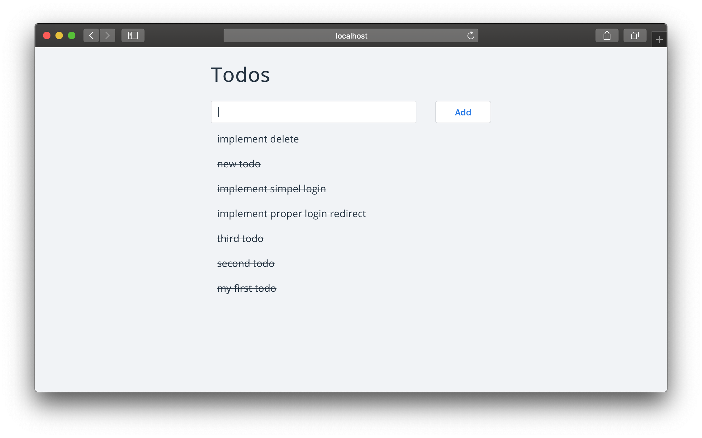

[](https://app.fossa.io/projects/git%2Bgithub.com%2Fdominickolbe%2Fhas-to-be-done?ref=badge_shield)
[](https://travis-ci.com/dominickolbe/has-to-be-done)

<p align="center">
  <p align="center">:clipboard: :soon: :white_check_mark:</p>
  <h3 align="center">has-to-be-done</h3>
  <p align="center">Simple todo app written in react and using firebase<p>
</p>

<p align="center"></p>

## Install dependencies
make sure you have installed all dependencies before moving on
```
$ yarn
```

## Development
develop application
```
$ yarn start
```

## Production
build application
```
$ yarn build
```

## Deployment
this command first builds the application and then deploys it to firebase
```
$ yarn deploy
```

## License
MIT License

Copyright (c) 2019 [Dominic Kolbe](https://dominickolbe.dk)


[](https://app.fossa.io/projects/git%2Bgithub.com%2Fdominickolbe%2Fhas-to-be-done?ref=badge_large)
